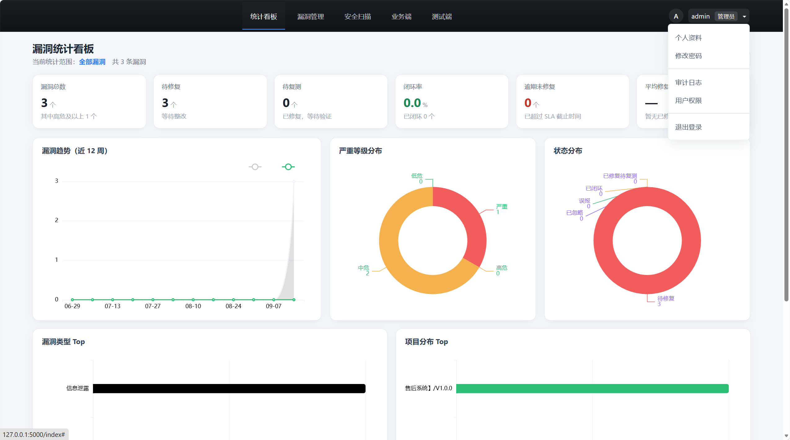

SDL 安全管理平台
================

基于 Flask + SQLite + Bootstrap 的漏洞管理平台，集漏洞录入、状态流转、
检索筛选、统计看板、多角色权限控制与数据审计追溯于一体。

## 项目截图

快速开始
--------

    pip install -r requirements.txt

    venv\Scripts\activate          （Windows）
    source venv/bin/activate       （macOS / Linux）

    python run.py

浏览器打开 http://127.0.0.1:5000

演示数据
--------

现有 instance/sdl.db 数据较少。生成一份覆盖全部状态与维度的脱敏演示数据：

    python seed_demo.py                    -> 写入 instance/sdl_demo.db（不动原库）
    python seed_demo.py --db instance/sdl.db   -> 写入原库（会先自动备份）

覆盖 10 个用户 / 5 个项目 / 5 个任务 / 64 条漏洞（含全部 5 种状态）/
10 次安全扫描（三类各若干，共 32 条发现）。

生成后用该库启动：

    set SDL_DB=instance/sdl_demo.db && python run.py      （Windows）
    SDL_DB=instance/sdl_demo.db python run.py            （macOS / Linux）

演示账号密码统一为 demo123456：
    admin / lead01       管理员、测试主管
    tester01 / tester02  测试人员
    dev01 / dev02 / dev03 开发人员
    biz01 / biz02        业务人员
    guest01              访客

测试
----

    venv\Scripts\python -m pytest -q

注意：pytest 的收集范围限定在 tests/（见 pytest.ini）。app/test_cases.py 是
156 条测试用例名称的常量表，不是测试代码，不限定会被误收集。

目录结构
--------

    app/
      __init__.py        应用工厂、蓝图注册、错误页、模板全局变量
      config.py          配置（SECRET_KEY 持久化、CSRF、数据库路径）
      models.py          数据模型（8 张表，含索引）
      permissions.py     角色与权限矩阵、数据可见范围
      state_machine.py   漏洞状态机（唯一的改状态入口）
      labels.py          枚举 → 中文标签/徽章配色的唯一来源
      analytics.py       统计看板的数据聚合
      services.py        跨蓝图公共逻辑（风险评分、SLA、漏洞编号、级联删除、审计）
      migrations.py      SQLite 轻量补列/补索引迁移
      forms.py           WTForms 表单与选项常量
      routes/            auth / main / vulnerabilities / projects / audit / scans
      templates/         Jinja2 模板（继承 base.html）
      static/css/        app.css —— 全站唯一样式来源（设计 token + .ui-* 组件）

    tests/               pytest 测试套件（14 个文件）
    seed_demo.py         脱敏演示数据生成脚本
    scripts/             离线维护脚本（回收未被引用的上传图片）
    instance/            SQLite 数据库、上传的截图、secret.key

安全扫描
--------

「安全扫描」是独立导航项，含三个子分类：

    sast        源代码扫描    SonarQube / Fortify / Semgrep / CodeQL
    sca         组件扫描      Snyk / Trivy / OWASP Dependency-Check
    container   容器镜像扫描  Trivy / Clair / Anchore / Aqua

对应 SDL 里「研发控制」阶段的自动化检测环节，结果同时嵌入业务端
「研发控制」页（/business?stage=development），按三类汇总展示。

录入时可直接粘贴扫描器输出，每行一条：
    等级 | 规则编号 | 标题 | 位置
    严重|CWE-89|用户中心接口 SQL 注入|src/user/dao.py:88
后两段可省略，等级支持中英文（严重/Critical、高危/High…）。

权限划分参照业界通行做法（GitHub Advanced Security 的 Read/Manage alerts
两级、Prisma Cloud 的 DevSecOps User、Semgrep 的 Member/Read-only、
Invicti 的 Developer 只读角色）：

    角色          查看范围            录入  处置  转漏洞  编辑删除
    admin         全部                 ✓    ✓    ✓      ✓
    test_lead     全部                 ✓    ✓    ✓      ✓
    tester        全部                 ✓    ✓    ✓      —
    business      本人名下项目          —    —    —      —
    developer     本人参与的项目        —    —    —      —
    guest         无                   —    —    —      —

「本人参与的项目」= 自己是项目负责人，或该项目里有指派给自己的漏洞。
开发人员看不到与自己无关的项目扫描结果。

发现明细默认只是"待梳理"的数据，在扫描详情页勾选后才生成漏洞记录并进入
「待修复 → 已修复 → 已闭环」的流转。刻意不做自动全转 —— 业界一致建议
先梳理再分派，否则低危噪音会把开发淹没。

关键设计
--------

状态机：pending → fixed → closed 为主链（任务书要求的三态流转）；
false_positive（误报）/ ignored（已忽略）为终止分支；reopen 是终止态唯一的回退路径。
所有状态变更都必须经 app/state_machine.py 校验，编辑页不能直接改状态。

复测历史：状态机每次流转都会往 verification_history 追加一条记录（操作人、
结论、说明、时间），漏洞详情页以时间线呈现，误报/忽略也走同一条路径。

权限：功能权限（PERMISSIONS 矩阵）与数据可见范围（apply_vuln_scope /
apply_scan_scope）是两个
正交维度。列表页、详情页、导出、看板共用同一套范围判断，避免出现
"列表里有、点进去 403" 的死链或借导出越权。

审计：漏洞录入、状态流转、任务分配/开始/审核、用例状态变更、迭代创建、
用户角色变更/删用户/改密码、扫描录入与发现转漏洞等关键操作均写入
audit_logs，可在「审计日志」页按操作人/资源/动作/时间检索。

前端：全站单一样式来源 app/static/css/app.css（设计 token + .ui-* 组件）。
模板里不再有硬编码色值、不再用 Bootstrap 原生组件、不再各写一份状态/等级
中文映射 —— 这些分别有测试守着（见 tests/test_css_hygiene.py、
tests/test_pages.py 的棘轮断言）。
